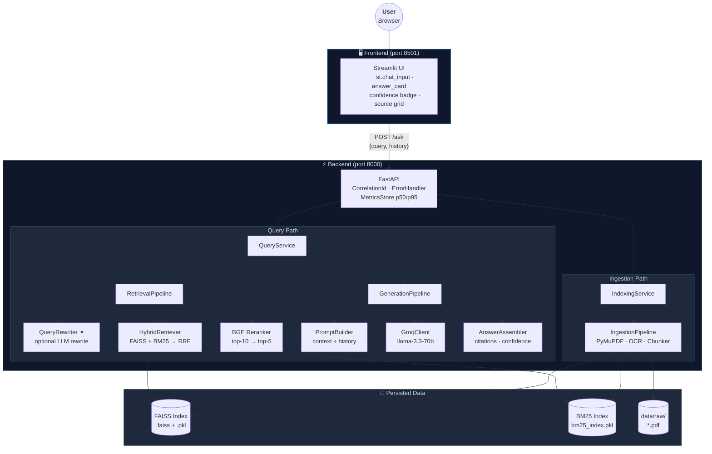
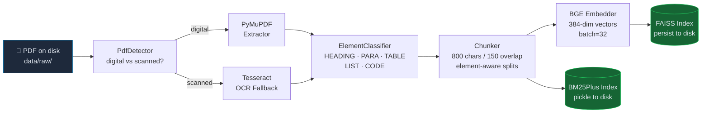
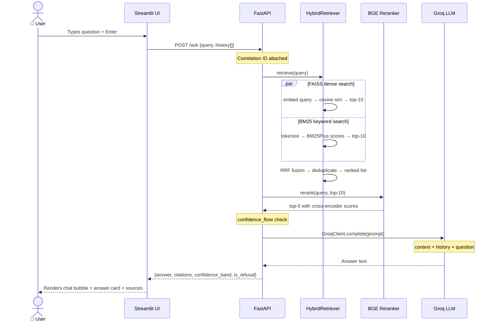

<div align="center">

# 🔍 Enterprise Knowledge Assistant

**Production-grade RAG system — grounded answers with citations over your PDFs**

[](https://python.org)
[](https://fastapi.tiangolo.com)
[](https://streamlit.io)
[](https://groq.com)
[](https://faiss.ai)
[](./tests)
[](./LICENSE)

<br/>

> Upload your enterprise PDFs. Ask questions in plain English.  
> Get grounded, cited answers with confidence scores — never hallucinated.

<br/>

```
┌──────────────┐    ┌──────────────┐    ┌──────────────┐    ┌──────────────┐
│  Upload PDF  │ →  │  Ask in Chat │ →  │ Cited Answer │ →  │  Confidence  │
│  data/raw/   │    │  st.chat_input│   │  + Sources   │    │  HIGH 87%    │
└──────────────┘    └──────────────┘    └──────────────┘    └──────────────┘
```

</div>

---

## ✨ What Makes This Different

<table>
<tr>
<td width="50%">

**🧩 Element-Aware Ingestion**  
Headings, paragraphs, tables, lists, and code blocks are extracted and chunked according to their *structure* — tables never split mid-row, headings stay with their section.

**🔀 Hybrid Search**  
Fuses dense (FAISS cosine) and sparse (BM25Plus) retrieval via Reciprocal Rank Fusion. Dense search handles semantics; BM25 rescues exact-match terms like product codes, names, and rare acronyms.

**🎯 Cross-Encoder Reranking**  
Top-10 candidates are rescored by `bge-reranker-base` — a cross-encoder that reads query + chunk together, catching nuance that bi-encoder similarity misses.

</td>
<td width="50%">

**💬 Conversation Memory**  
Full chat interface with session history. Follow-up questions like *"What does that mean?"* or *"Give me an example"* are resolved in context against prior turns.

**🛡️ Grounded Generation**  
Prompt-enforced source attribution. When retrieval confidence falls below the configured floor, the system refuses rather than hallucinating. Every claim traces to a source chunk.

**📊 Observable by Default**  
JSON-structured logs with correlation IDs, per-stage p50/p95 latency metrics at `/metrics`, and a 15-question benchmark suite for regression testing.

</td>
</tr>
</table>

---

## 🏗️ Architecture



---

## 🔄 Data Flow

### Ingestion  *(run once per document set)*



### Query  *(per request)*



### Confidence Scoring

```
Raw signal: rerank_score (CrossEncoder logit) + similarity_score (cosine)

confidence = 0.6 × sigmoid(avg_rerank) + 0.4 × top_similarity

 ╔══════════════════════════════════════════════════════╗
 ║  🟢  HIGH    ≥ 70%  ████████████████████  Trustworthy ║
 ║  🟡  MEDIUM  ≥ 40%  ████████████          Plausible   ║
 ║  🔴  LOW     < 40%  ████████              Uncertain   ║
 ║  ⚠️   REFUSAL floor  ████                  No LLM call ║
 ╚══════════════════════════════════════════════════════╝
```

---

## 🚀 How to Run

### Prerequisites

| Requirement | Version | Where to get it |
|---|---|---|
| Python | **3.11** | [python.org](https://python.org) |
| Groq API key | free tier | [console.groq.com](https://console.groq.com) |
| Tesseract | any | Only for scanned PDFs — optional |

<details>
<summary>📦 Installing Tesseract (optional, for scanned PDFs)</summary>

```bash
# macOS
brew install tesseract

# Ubuntu / Debian
sudo apt install tesseract-ocr

# Windows — download the UB-Mannheim installer:
# https://github.com/UB-Mannheim/tesseract/wiki
```

</details>

### 1 — Clone & Install

```bash
git clone https://github.com/your-org/enterprise-knowledge-assistant.git
cd enterprise-knowledge-assistant

python -m venv venv
source venv/bin/activate          # Windows: venv\Scripts\activate

pip install -r requirements.txt
```

> **GPU users (RTX / CUDA):** install the CUDA 12.8 PyTorch build *before* `pip install`:
> ```bash
> pip install torch --index-url https://download.pytorch.org/whl/cu128
> ```
> Then set `DEVICE=cuda` in `.env`. The system runs end-to-end on CPU by default.

### 2 — Configure

```bash
cp .env.example .env
```

Open `.env` and set your key:

```env
GROQ_API_KEY=gsk_...your_key_here...
```

Everything else has sensible defaults. See the [Configuration](#️-configuration) section below.

### 3 — Create Data Directories

```bash
mkdir -p data/raw data/processed data/vector_store
```

### 4 — Start the API

```bash
# Terminal 1
uvicorn main:app --reload
# → http://localhost:8000
# → http://localhost:8000/docs   (Swagger UI)
```

### 5 — Start the UI

```bash
# Terminal 2
streamlit run streamlit_app.py
# → http://localhost:8501
```

### 6 — Index Your PDFs

**Option A — via UI:**  
Open `http://localhost:8501`, go to the **Admin** page → click **Rebuild Index**

**Option B — via terminal:**
```bash
# Drop PDFs into data/raw/, then:
curl -X POST http://localhost:8000/rebuild-index | python -m json.tool
```

Expected response:
```json
{
  "total_chunks": 312,
  "documents": ["policy.pdf", "handbook.pdf"],
  "elapsed_ms": 4820
}
```

### 7 — Ask Questions

Switch to the **Ask** page. The chat interface remembers your conversation — follow-up questions like *"What does that mean?"* or *"Can you give an example?"* are resolved in context.

---

## ⚙️ Configuration

All tunables live in `.env`. No hardcoded values in source code.

| Variable | Default | Description |
|---|---|---|
| `GROQ_API_KEY` | *(required)* | Groq API key |
| `GROQ_MODEL` | `llama-3.3-70b-versatile` | LLM model ID |
| `DEVICE` | `cpu` | `cpu` or `cuda` |
| `EMBEDDING_MODEL` | `BAAI/bge-base-en-v1.5` | Bi-encoder for retrieval |
| `RERANKER_MODEL` | `BAAI/bge-reranker-base` | Cross-encoder for reranking |
| `CHUNK_SIZE` | `800` | Paragraph chunk size (chars) |
| `CHUNK_OVERLAP` | `150` | Paragraph chunk overlap (chars) |
| `TOP_K_RETRIEVAL` | `10` | Candidates from vector search |
| `TOP_K_RERANK` | `5` | Survivors after cross-encoder |
| `CONFIDENCE_FLOOR` | `-3.0` | CrossEncoder logit below which the system refuses |
| `RETRIEVAL_MODE` | `semantic` | `semantic` or `hybrid` (BM25 + FAISS) |
| `RRF_K` | `60` | Reciprocal Rank Fusion constant |
| `QUERY_REWRITING_ENABLED` | `false` | LLM rewrites vague queries before retrieval |
| `MAX_HISTORY_TURNS` | `5` | Conversation turns injected into the prompt |
| `MAX_CONTEXT_CHARS` | `4000` | Max chars of retrieved context in the prompt |

---

## 🧪 Tests

```bash
pytest                       # run all 404 tests
pytest tests/rag/            # retrieval + generation only
pytest tests/api/            # API endpoint tests
pytest -v --tb=short         # verbose with short tracebacks
```

All tests run offline — no API keys, no GPU, no running server required.  
Fake embedders (deterministic bag-of-words), stub LLM clients, and in-memory FAISS stores.

---

## 🧠 Technical Decisions

<details>
<summary><strong>Why FAISS over Qdrant or Chroma?</strong></summary>

FAISS is local-first and zero-dependency — no Docker container, no network call, no auth token. For an enterprise POC scoped to a single machine, the operational simplicity outweighs Qdrant's distributed features. The `VectorStore` ABC makes swapping trivial: implement the interface, update the factory, done.

</details>

<details>
<summary><strong>Why BM25Plus over BM25Okapi?</strong></summary>

`BM25Okapi` uses `IDF = log((N - df + 0.5) / (df + 0.5))`. When a term appears in exactly half the corpus (df = N/2), IDF collapses to 0, silently returning zero scores for all documents — catastrophic for small corpora. `BM25Plus` uses `IDF = log((N + 1) / df)`, always positive. This was caught by failing tests on 2-document corpora during Phase 13.

</details>

<details>
<summary><strong>Why Reciprocal Rank Fusion (RRF) over score normalisation?</strong></summary>

Dense (cosine similarity, range 0–1) and sparse (BM25, unbounded) scores live on different scales. Normalising and weighting them requires hand-tuning that breaks as the corpus changes. RRF avoids this entirely — it only uses rank position, so it is scale-invariant and requires no calibration. The constant k=60 is the established default from the original Cormack et al. paper.

</details>

<details>
<summary><strong>Why cross-encoder reranking as a second stage?</strong></summary>

Bi-encoder retrieval is fast but approximate — it compresses query and document into independent vectors, losing cross-attention signals. A cross-encoder reads both together, catching phrasing nuance that bi-encoder cosine similarity misses. Running it only over the top 10 (not the full corpus) keeps latency under ~200 ms on CPU.

</details>

<details>
<summary><strong>Why PyMuPDF-first with Tesseract fallback?</strong></summary>

OCR is expensive (~2–5× slower) and introduces noise (character recognition errors contaminate embeddings). The `PdfDetector` checks for selectable text first; only scanned pages that return no text blocks trigger Tesseract. In a typical enterprise document set, 80–90% of PDFs are digital, so OCR is rarely invoked.

</details>

<details>
<summary><strong>Why element-aware chunking?</strong></summary>

Splitting a table mid-row, a heading from its section body, or a code block at an arbitrary character boundary destroys the retrievable unit of meaning. The `ElementClassifier` assigns a type to each extracted block; the `Chunker` applies type-specific rules — tables and headings are never split, paragraphs use sliding window at 800/150.

</details>

<details>
<summary><strong>Why client-side conversation history?</strong></summary>

Storing chat sessions server-side would require a session store (Redis, DB) and a user identity layer. Sending history from the client on each request keeps the API stateless — it can be horizontally scaled with no coordination. The server truncates to `MAX_HISTORY_TURNS` before prompt injection, so payload size stays bounded.

</details>

---

## 🏗️ Repo Structure

```
enterprise-knowledge-assistant/
│
├── app/
│   ├── api/                  ← FastAPI routers + schemas + middleware
│   ├── ui/                   ← Streamlit pages, components, styles
│   ├── ingestion/            ← PDF → chunks pipeline
│   │   └── document_processing/  PyMuPDF · OCR · classifier · chunker
│   ├── rag/
│   │   ├── retrieval/        ← embedder · FAISS · BM25 · hybrid · reranker · rewriter
│   │   ├── generation/       ← prompt builder · Groq client · assembler
│   │   └── prompts/          ← system_prompt.md · query_rewrite_prompt.md
│   ├── evaluation/           ← benchmark runner + metrics
│   ├── config/               ← Settings (pydantic-settings) · logging
│   ├── models/               ← Chunk · Answer · RetrievalResult · ConversationTurn
│   ├── services/             ← QueryService · IndexingService · factory
│   ├── utils/                ← text cleaning · hashing · timing
│   └── middleware/           ← correlation IDs · error handling
│
├── scripts/                  ← run_eval.py CLI
├── tests/                    ← 404 pytest tests (mirrors app/)
├── docs/                     ← setup · api · ADRs · design decisions
├── data/                     ← raw/ · processed/ · vector_store/ (gitignored)
│
├── main.py                   ← FastAPI entrypoint
├── streamlit_app.py          ← Streamlit entrypoint
├── requirements.txt
├── .env.example
└── ARCHITECTURE.md · SPEC.md · PLAN.md · EVALUATION.md
```

---

## ⚠️ Known Limitations

| Limitation | Impact | Workaround / Future path |
|---|---|---|
| **FAISS is in-process** | Single machine; can't scale reads across nodes | Swap `FaissVectorStore` → `QdrantVectorStore` (same ABC) |
| **No incremental indexing** | Every rebuild re-indexes all PDFs from scratch | Add `delta_ingest()` path using content hashes to skip unchanged docs |
| **BM25 index in RAM** | Full chunk corpus loaded at startup; OOM risk for very large corpora | Replace with Elasticsearch BM25 endpoint behind the same retriever interface |
| **Groq free-tier rate limits** | ~6,000 tokens/min; heavy use triggers 429s | Add back-pressure queue in `GroqClient`; or self-host via vLLM |
| **No streaming output** | Response only appears when the full LLM completion arrives | `GroqClient.stream()` + Streamlit `st.write_stream()` |
| **No user authentication** | Single-tenant; all users share one index | Auth middleware + per-tenant FAISS segments (Phase 17 in roadmap) |
| **OCR quality** | Tesseract accuracy degrades on low-resolution scans or non-Latin scripts | Upgrade to EasyOCR or a vision-capable LLM for page images |
| **Context window cap** | `MAX_CONTEXT_CHARS=4000` limits how much evidence the LLM sees | Increase with a long-context model; or use map-reduce summarisation |
| **Conversation history sent by client** | Very long sessions bloat request payload | Server-side session store (Redis) with UUID session token |

---

## 📊 Evaluation

```bash
python scripts/run_eval.py
```

Runs 15 benchmark questions across 3 source documents and writes a markdown report to `docs/eval-reports/`.

| Metric | Description |
|---|---|
| `retrieval_precision@5` | Fraction of top-5 chunks containing the expected source |
| `citation_accuracy` | Fraction of cited chunks that actually support the answer |
| `hallucination_rate` | Answers containing claims absent from retrieved context |
| `refusal_rate_on_unsupported` | Correct refusals for out-of-scope questions |
| `latency_p50 / p95` | End-to-end response time percentiles |

Live latency metrics are also available at `http://localhost:8000/metrics` while the server is running.

---

## 📚 Documentation

| Document | Contents |
|---|---|
| [`ARCHITECTURE.md`](./ARCHITECTURE.md) | Module boundaries, data flow, design decisions |
| [`PLAN.md`](./PLAN.md) | Phased build plan with acceptance criteria per phase |
| [`SPEC.md`](./SPEC.md) | Requirements as a checkable acceptance list |
| [`EVALUATION.md`](./EVALUATION.md) | Benchmark methodology and metric definitions |
| [`docs/setup.md`](./docs/setup.md) | Full setup including GPU, CUDA 12.8, and Tesseract |
| [`docs/api.md`](./docs/api.md) | HTTP endpoint reference with curl examples |
| [`docs/design-decisions.md`](./docs/design-decisions.md) | Detailed rationale for architectural choices |
| [`docs/limitations.md`](./docs/limitations.md) | Known limits and operational caveats |
| [`docs/deployment.md`](./docs/deployment.md) | Local, Docker, and cloud deployment guide |
| [`docs/adr/`](./docs/adr/) | Architecture Decision Records |

---

<div align="center">

**Built with FastAPI · Streamlit · FAISS · BGE · Groq · rank-bm25 · LangChain · PyMuPDF**

*Internal project — not licensed for redistribution*

</div>
